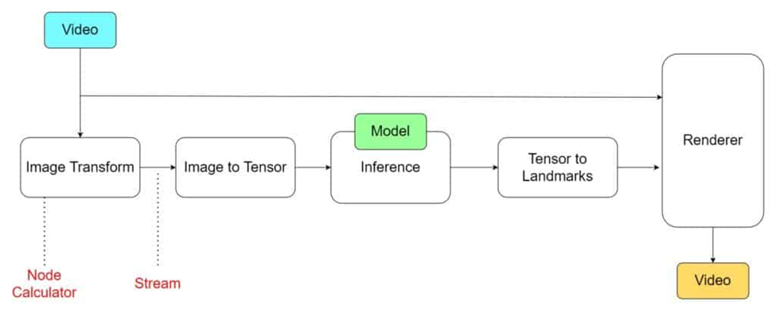
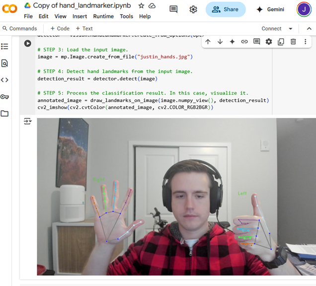
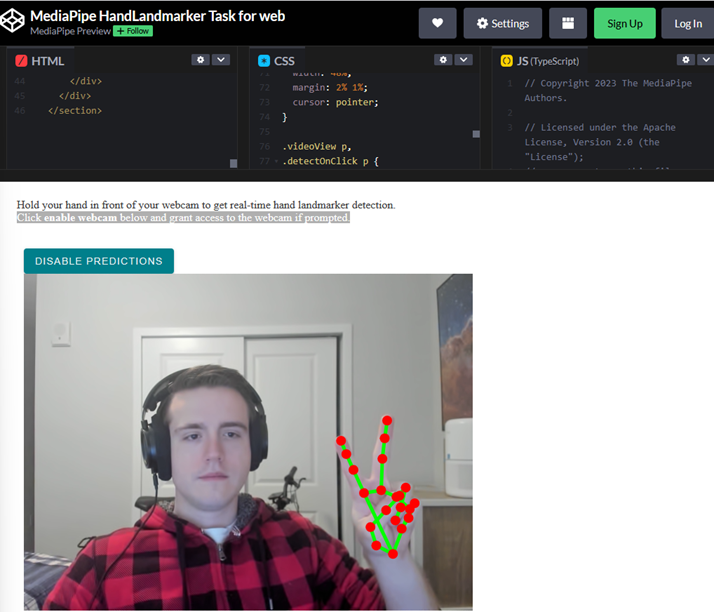
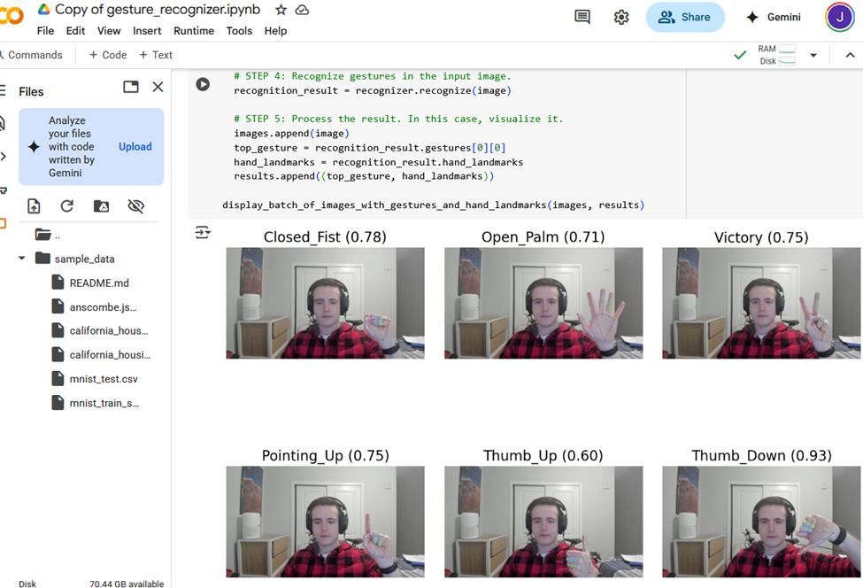
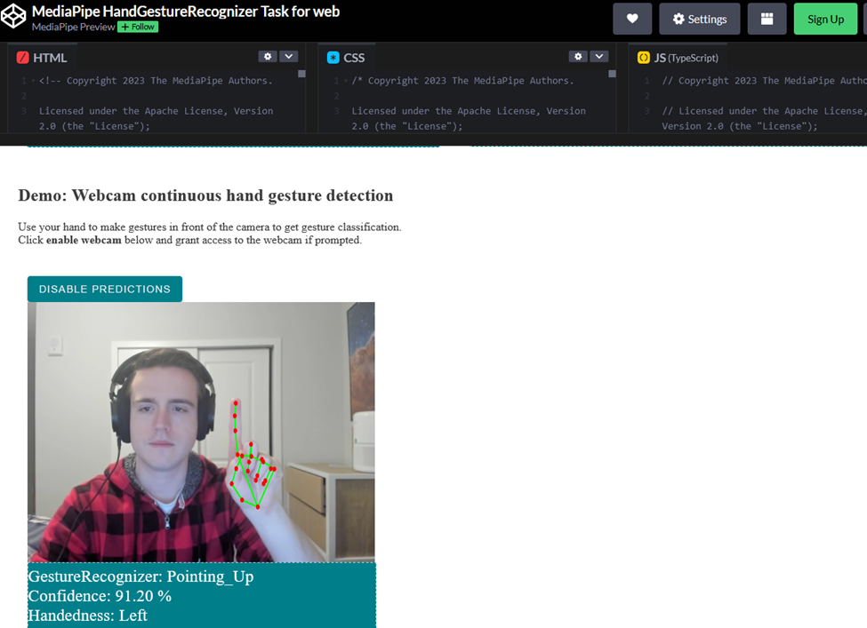

# 2025-06-03 Report / Justin Brown's Notes.

## Components

### MediaPipe Solutions Suite

- [Guide](https://ai.google.dev/edge/mediapipe/solutions/guide)

- **MediaPipe Solutions** is a suite of libraries and tools to quickly apply AI and machine ML techniques in your applications, whether pre-built or custom models.
- **MediaPipe Tasks**: Cross-platform APIs and libraries for deploying solutions. [Learn More](https://ai.google.dev/edge/mediapipe/solutions/model_maker)
- **MediaPipe Models**: Pre-trained, ready-to-run models for use with each solution.
- **MediaPipe Model Maker**: Customize models for solutions with your data. [Learn More](https://ai.google.dev/edge/mediapipe/solutions/model_maker)
- **MediaPipe Studio**: Visualize, evaluate, and benchmark solutions in your browser. [Learn More](https://ai.google.dev/edge/mediapipe/solutions/studio)

### MediaPipe Tasks

- [Main Page](https://ai.google.dev/edge/mediapipe/solutions/tasks)

- **Core programming interface** of solutions, including a set of libraries for **deploying ML solutions onto devices with a minimum of code**.

- Customizable: **can deploy custom models** using Tasks GestureRecognizer API.

### Model Maker

- [Main Page](https://ai.google.dev/edge/mediapipe/solutions/model_maker)

- Can create models built with Model Maker GestureRecognizer API for custom gestures.

- **A faster alternative to building and training a new ML model from scratch.**

- Model Maker uses an ML training technique called [transfer learning](https://en.wikipedia.org/wiki/Transfer_learning) which retrains existing models with new data. This technique re-uses a significant portion of the existing model logic, which means training takes less time than training a new model, and can be done with less data.”

- Retraining? Aim to have approximately 100 data samples for each trained class.

### MediaPipe Studio

- [Main Page](https://mediapipe-studio.webapps.google.com/home)

- MediaPipe Studio is a web-based application for evaluating and customizing on-device ML models and pipelines for your applications.

- Quickly test and alter settings to MediaPipe solutions in your browser with your own data, and your own customized ML models.

### MediaPipe Framework

- [Main Page](https://ai.google.dev/edge/mediapipe/framework)

- **Low-level component**: Used to build efficient on-device machine learning pipelines, similar to the premade [MediaPipe Solutions](https://ai.google.dev/edge/mediapipe/solutions/guide.md).

- **Landmarks**: x, y, z coordinates where z is depth for each of 21 landmarks, relative to the wrist.

- **World Landmarks**: Relative to the hand’s geometric center, in meters.

- **Handedness**: Left or Right hand detected.

### Hand Landmark Detection

- [Main Page](https://ai.google.dev/edge/mediapipe/solutions/vision/hand_landmarker)

- The MediaPipe Hand Landmarker Task Detects the **landmarks** of the hands in an image, video, or livestream.

- Each **node** is a '**Calculator**'

- Each **edge** is an '**Stream**'

- **Packets** contain timestamped data, enter and leave via '**ports**' in the **calculator**

- Every time a graph runs, the Framework implements **Open**, **Process**, and **Close** methods in the calculators. Open initiates the calculator; the process repeatedly runs when a packet enters. The **process** is closed after an entire graph run.

**Note**: If you use the video mode or live stream mode, Hand Landmarker uses tracking to avoid triggering palm detection model on every frame, which helps reduce latency.

## Landmark Detection

- [Main Page](https://ai.google.dev/edge/mediapipe/solutions/vision/hand_landmarker)

### Python Demo (Personal, because the original had an import bug)

- [Demo](https://colab.research.google.com/drive/1mIm-t3JNBOqohWiQ91-GpY4d5ImnbyUI?usp=sharing)

### Web Demo

- [Demo](https://codepen.io/mediapipe-preview/pen/gOKBGPN)

## Gesture Recognizer

- [Main Page](https://ai.google.dev/edge/mediapipe/solutions/vision/gesture_recognizer)

### Python Demo (Another import bug)

- [Demo](https://colab.research.google.com/drive/1gR_3Lco7Yw1tNRCDRqzNBybLy1Mmq1Mp#scrollTo=TUfAcER1oUS6)

### Web Demo

- [Demo](https://codepen.io/mediapipe-preview/pen/zYamdVd)

### Customizing Gestures

- [Main Page](https://ai.google.dev/edge/mediapipe/solutions/customization/gesture_recognizer)

- [Example Dataset](https://www.kaggle.com/datasets/innominate817/hagrid-sample-30k-384p)

## Questions

1. How low-level do we need to go?
2. Focus on Python or Web?
3. Should we learn a bit of OpenCV?
4. Gestures with just the hands or human poses?

## Future Looking-into:

1. https://swiperjs.com/
2. CV Virtual Mouse
3. CV Virtual Swiping

## Ideas / Plan:

1. MediaPipe Tasks / Model Maker to train custom model.
2. Chrome extension that uses the webcam to get the input, and JavaScript functions that interpret these gestures and interact with webpage.

## SCOPE Ideas:

1. One front-facing camera
2. Gesture classes
   - Thumbs up/down
   - Point up/down/left/right
   - Two fingers up/down/left/right
   - Open palm hand
   - Closed fist.
   - OK hand-sign. Apparently this is controversial now so idk, didn't use to be.
   - Rock, Paper, Scissors
   - Numbers 0-5
   - German Three.
   - Gator Chomp.
   - Sign Language.
3. A visual/auditory feedback for recognition.

## Consider Applications:

1. Gestures keep interaction hands-free and sanitary in environments like hospitals or greasy workshops.
2. A game that uses gestures as the input. Xbox Kinect did a dance game. Rhythm games?
3. Arm Fatigue was an issue with long-term touchscreen use on Vertical screens. Consider having cameras placed elsewhere and have the arm at rest if this is meant to be long-term use.
4. Drivers uses gestures for safe interaction.
5. Robots that respond to gestures, play against you in rock paper scissors, or checkers, etc.
