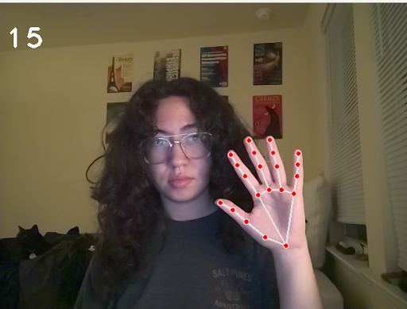
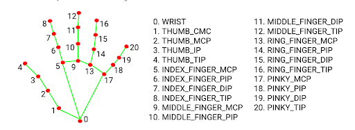
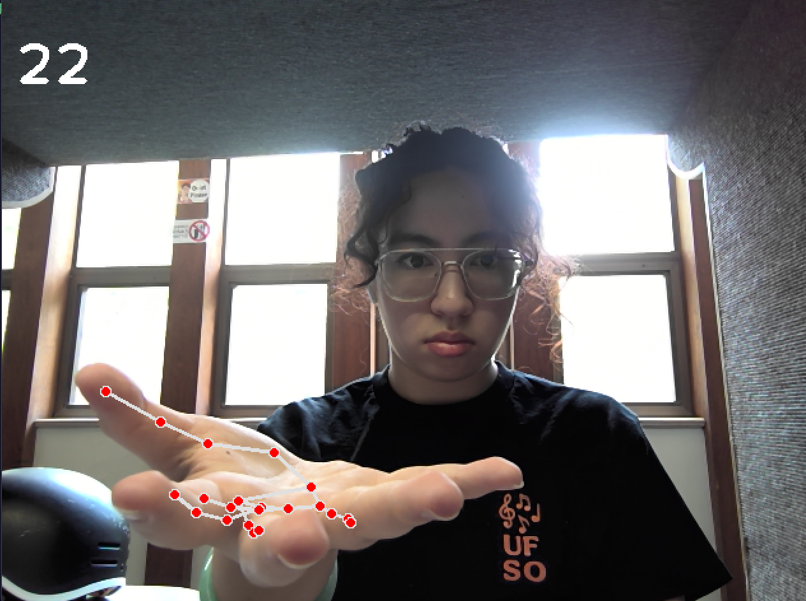
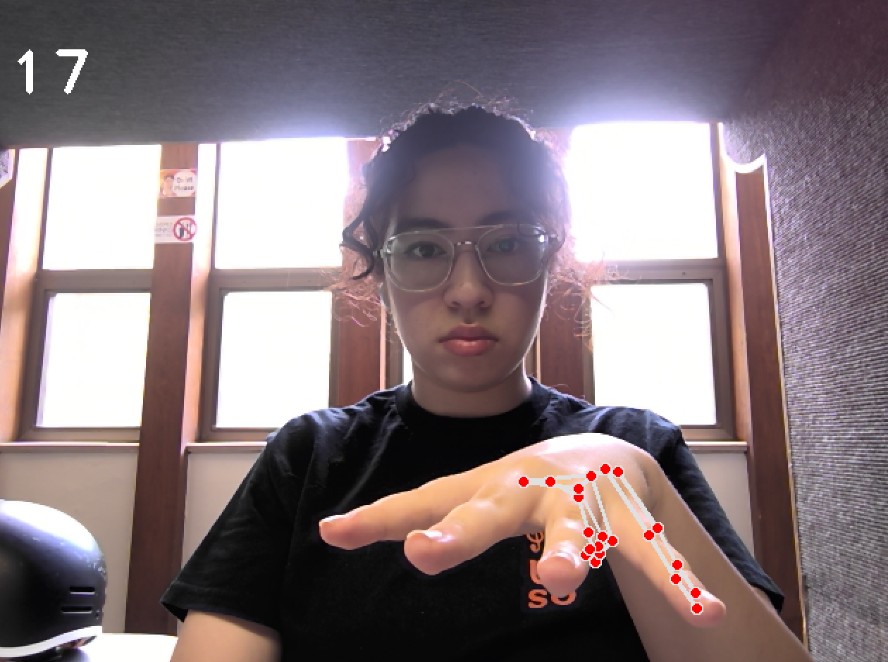
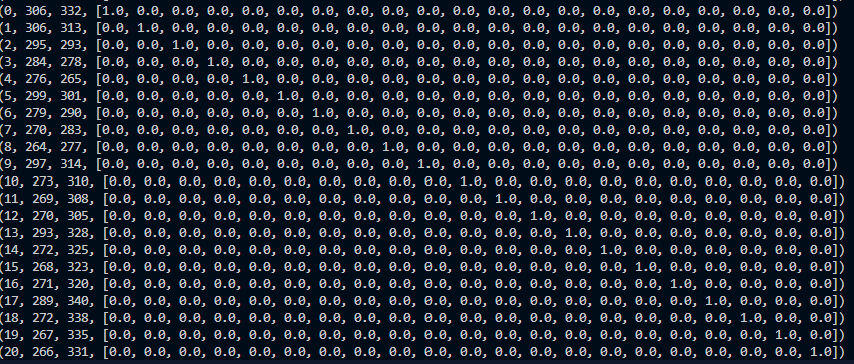

**2025-06-13 Report / Rachel McCallum's Notes**

**Current Program:**

* **Description:**
    * Takes in WebCam footage and continuously prints coordinates for each of the 21 landmarks while displaying FPS and hand tracking in the image window.
    * 

    * 

* **Notes:**
    * Currently, the landmark data coordinates are based on image coordinates/pixels
    * The program uses the mediapipe library, as opposed to the Mediapipe Hand Landmarker Task taskfile
    * Currently works from livestream feed, will adapt to reading datasets and still images
    * Right now it can change between hands (can lock onto either hand, not sure how it chooses which), Max Hands being 2 (adjustable). When outputting the landmarks for two hands, it focused almost entirely on one hand. This seemed to be related to which hand was closest to (0,0), the top left corner of the image.
    * Some difficulty detecting flat palm hand positions (palm up and palm down), especially at close distances to camera/focal length
    * 

* **Output:**
* 

**Relevant libraries/functions:**

* **cv2: OpenCV**- used for image and video processing
    * **cvtColor**(image, color conversion type)- Changes the color format of the image
    * **VideoCapture**(webcam)- Opens a webcam or video file, 0 is default webcam, can be filename
    * **putText**(img, text, org, font, fontScale, color, thickness)- Draws text on an image
    * **imshow**(windowName, image)- Shows the image in a window
    * **waitkey**(delay) - Waits for a key press for delay milliseconds
* **Mediapipe:**
    * **mp.solutions**
        * **.hands**- The hand tracking model
            * **.static_image_mode**(bool)- If True, it treats input as separate images (good for photos). If False, it assumes video (and tries to track hands smoothly)
            * **.max_num_hands**(int)- Max number of hands to detect
            * **.min_detection_confidence**(float)- How confident the model must be to say “this is a hand”
            * **.min_tracking_confidence**(float)- How confident it needs to be to keep tracking a hand, used for video or live feed.
            * **.process**(image)- Runs the hand detection on an image, which is usually in RGB format
                * **.multi_hand_landmarks[]**- A list of detected hands; each has 21 landmark points
        * **.drawing_utils**- Tools to draw things like landmarks on images
            * **.draw_landmarks**(image, landmarks, connections)- Draws landmarks
                * image: The image to draw on.
                * landmarks: The points to draw (from multi_hand_landmarks).
                * connections: Which points to connect with lines (use predefined mp.solutions.hands.HAND_CONNECTIONS).

**Questions:**

* Since Mediapipe already deals with object detection and gesture classification, should we focus on transfer learning primarily?
* Continue with the library or adapt for the MediaPipe[ Hand Landmarker task](https://ai.google.dev/edge/mediapipe/solutions/vision/hand_landmarker#models)?

**Resources:**

* [Advanced Computer Vision with Python - Full Course](https://www.youtube.com/watch?v=01sAkU_NvOY)
